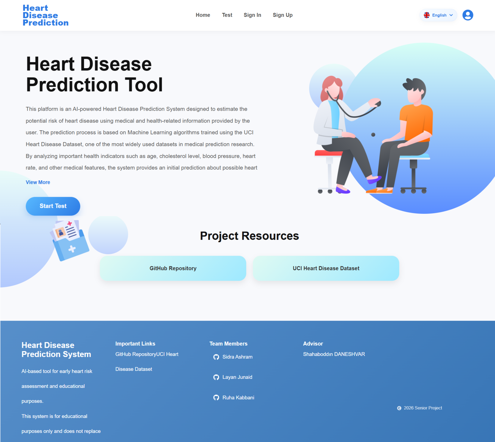
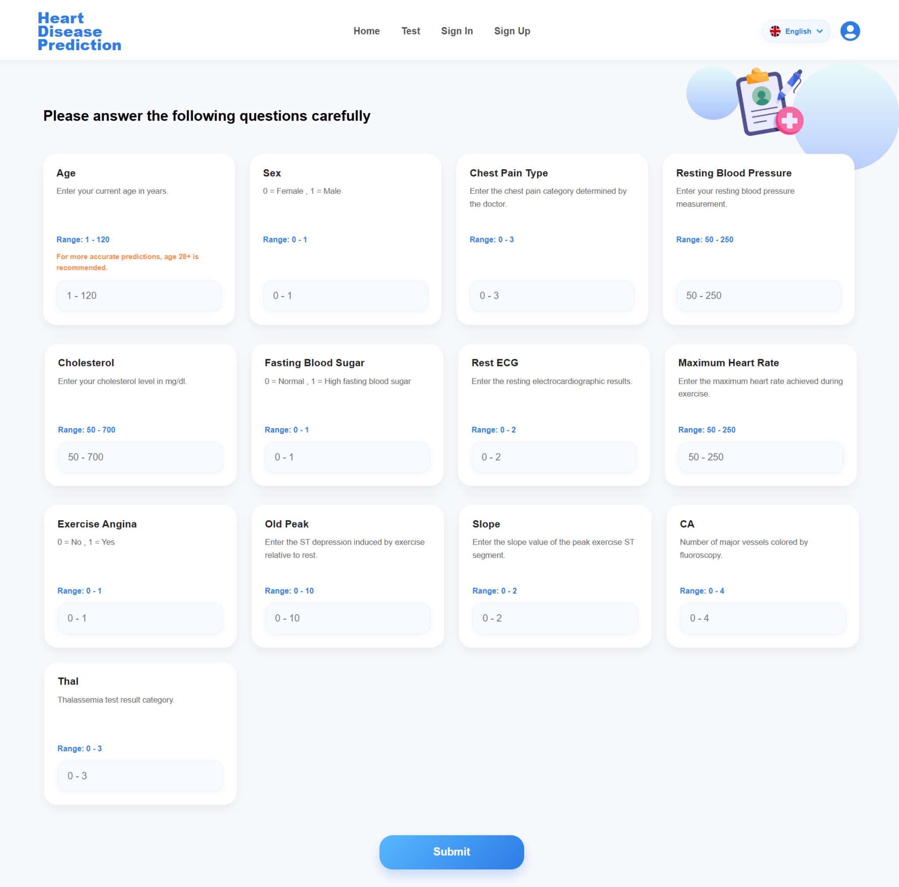
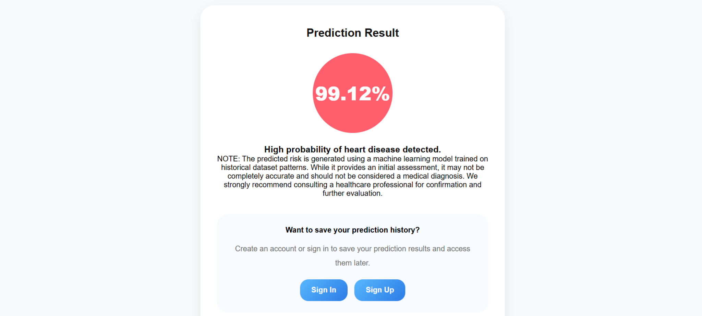

# Heart Disease Prediction Using Machine Learning & Feature Selection

An AI-powered full-stack web application for predicting heart disease risk using Machine Learning and Feature Selection techniques based on the Cleveland UCI Heart Disease Dataset.

 **Live Demo:**
[Heart Disease Prediction Website](https://heart-disease-prediction-virid-mu.vercel.app)

 **GitHub Repository:**
[GitHub Repository](https://github.com/LayanJunaid/heart-disease-prediction/tree/main)

---

#  Project Overview

Heart disease remains one of the leading causes of death worldwide, making early prediction and risk assessment critically important in healthcare systems.

This graduation project presents a complete Machine Learning-based Heart Disease Prediction System integrated into a modern full-stack web application. The system predicts the probability of heart disease using clinical and medical input features provided by the user.

The project was developed using the Cleveland UCI Heart Disease Dataset containing 303 patient records and 13 clinical input features. Multiple Machine Learning algorithms and Feature Selection approaches were evaluated to determine the most effective prediction model.

The final deployed solution integrates:

* A React.js frontend
* Express.js + Node.js backend
* Python-based Machine Learning inference layer
* MongoDB database
* RESTful API communication

The final production model is based on:

* **Support Vector Machine (SVM)**
* **Embedded Union Feature Selection**
* **StandardScaler preprocessing pipeline**

---

#  Features

* Full-stack AI-powered web application
* Real-time heart disease prediction
* Responsive modern user interface
* Machine Learning integration with REST API
* Input validation and error handling
* Prediction probability visualization
* Risk-level classification
* User authentication system
* Prediction history management
* Mobile-compatible responsive design
* Fast prediction response (<200ms)
* MongoDB prediction storage
* Modular scalable architecture

---

#  Machine Learning Pipeline

## Dataset

The system uses the **Cleveland UCI Heart Disease Dataset** containing:

* 303 patient instances
* 13 clinical input features
* Binary target classification

---

## Data Preprocessing

The preprocessing pipeline includes:

* Missing value handling using median imputation
* One-hot encoding for categorical features
* Feature standardization using StandardScaler
* Binary target conversion
* SMOTE class balancing

After preprocessing:

* Original 13 features became 22 machine learning features

---

## Feature Selection Techniques

### Filter Methods

* Chi-Square
* Correlation Filter

### Wrapper Methods

* RFECV
* Forward Selection
* Backward Elimination

### Embedded Methods

* LASSO
* Random Forest Importance
* Embedded Union

The best-performing method was:

* **Embedded Union Feature Selection**

---

## Machine Learning Algorithms

The following algorithms were evaluated:

* Logistic Regression
* Decision Tree
* Random Forest
* Support Vector Machine (SVM)
* K-Nearest Neighbors (KNN)
* XGBoost
* Naive Bayes
* Multi-Layer Perceptron (MLP)

All models were evaluated using:

* 5-Fold Stratified Cross-Validation

Evaluation Metrics:

* Accuracy
* Precision
* Recall
* F1-Score
* AUC-ROC

---

#  Final Model Results

| Model | Feature Selection | F1-Score | Accuracy |
| ----- | ----------------- | -------- | -------- |
| SVM   | Embedded Union    | 90.32%   | 90.2%    |

Key Findings:

* Feature selection improved 6 out of 8 models
* Embedded Union reduced feature dimensionality by 36%
* SVM achieved the most stable and highest-performing results
* All SVM ROC-AUC scores exceeded 0.90

---

#  System Architecture

The system follows a **Three-Tier Architecture**:

Frontend (React.js)
⬇
Express.js REST API Backend
⬇
Python Machine Learning Inference Layer
⬇
MongoDB Database

---

#  Technologies Used

## Frontend

* React.js
* JavaScript
* CSS
* Fetch API

## Backend

* Node.js
* Express.js
* REST API

## Machine Learning

* Python
* scikit-learn
* pandas
* numpy
* matplotlib
* XGBoost

## Database

* MongoDB
* Mongoose

## Deployment

* Vercel
* MongoDB Atlas

## Version Control

* Git
* GitHub

---

#  Application Screenshots

## Home Page



---

## Prediction Form Interface



---

## Prediction Result Interface



---

##  Project Structure

```bash
heart-disease-prediction/
│
├── heart-disease-backend/
│   ├── src/
│   │   ├── config/
│   │   ├── controllers/
│   │   ├── middleware/
│   │   ├── models/
│   │   ├── routes/
│   │   ├── services/
│   │   └── utils/
│   │
│   ├── ml/
│   ├── logs/
│   ├── app.js
│   ├── server.js
│   └── README.md
│
├── heart-disease-frontend/
│   ├── public/
│   ├── src/
│   │   ├── assets/
│   │   ├── components/
│   │   ├── pages/
│   │   ├── routes/
│   │   ├── styles/
│   │   └── translations/
│   │
│   ├── App.jsx
│   ├── main.jsx
│   └── README.md
│
├── ML_training/
│   ├── python/
│   ├── notebooks/
│   ├── processed.cleveland.data
│   └── README.md
│
├── screenshots/
│   ├── home.png
│   ├── test.png
│   └── result.png
│
├── package.json
├── package-lock.json
└── .gitignore
```

---

#  Installation & Setup

## Clone Repository

```bash
git clone https://github.com/LayanJunaid/heart-disease-prediction.git
```

---

## Backend Setup

```bash
cd backend
npm install
npm start
```

---

## Frontend Setup

```bash
cd frontend
npm install
npm run dev
```

---

## Python ML Setup

```bash
pip install -r requirements.txt
```

---

# API Endpoint

## Predict Heart Disease

```http
POST /api/predict
```

### Sample Request

```json
{
  "age": 54,
  "sex": 1,
  "cp": 0,
  "trestbps": 122,
  "chol": 286,
  "fbs": 0,
  "restecg": 0,
  "thalach": 116,
  "exang": 1,
  "oldpeak": 3.2,
  "slope": 1,
  "ca": 2,
  "thal": 2
}
```

### Sample Response

```json
{
  "success": true,
  "result": {
    "prediction": 1,
    "probability": 0.7823,
    "riskLevel": "high",
    "modelUsed": "SVM + Embedded Union"
  }
}
```

---

#  Frontend Features

* Real-time prediction results
* Dynamic probability visualization
* Form validation
* Loading state handling
* API error handling
* Responsive mobile layout
* Modular React architecture
* React Hooks (useState, useEffect)

---

#  Disclaimer

This project is intended for:

* Educational purposes
* Academic research
* Machine Learning experimentation

This application is **NOT** a medical diagnostic tool and should not replace professional medical consultation.

---

#  Team Members

* Sidra Ashram
* Layan Junaid
* Ruha Kabbani

### Supervisor

* Prof. Dr. Shahaboddin DANESHVAR

---

#  Future Improvements

* Cloud deployment using AWS/Azure
* Additional medical datasets integration
* Deep learning models (LSTM / Transformers)
* Clinical dashboard system
* Real-time hospital integration
* Enhanced explainable AI visualizations

---

#  License

This project was developed for academic and educational purposes as a Software Engineering Graduation Project at Hasan Kalyoncu University.

---

#  References

* Cleveland UCI Heart Disease Dataset
* scikit-learn Documentation
* XGBoost Documentation
* Research papers referenced in the final report

---

##  Final Production Configuration

| Component          | Final Selection              |
| ------------------ | ---------------------------- |
| Final Model        | Support Vector Machine (SVM) |
| Feature Selection  | Embedded Union               |
| Scaling Method     | StandardScaler               |
| Frontend           | React.js                     |
| Backend            | Express.js + Node.js         |
| Database           | MongoDB                      |
| ML Inference Layer | Python                       |
| API Communication  | REST API + JSON              |

---

Developed as a Graduation Project in Software Engineering at Hasan Kalyoncu University. 
